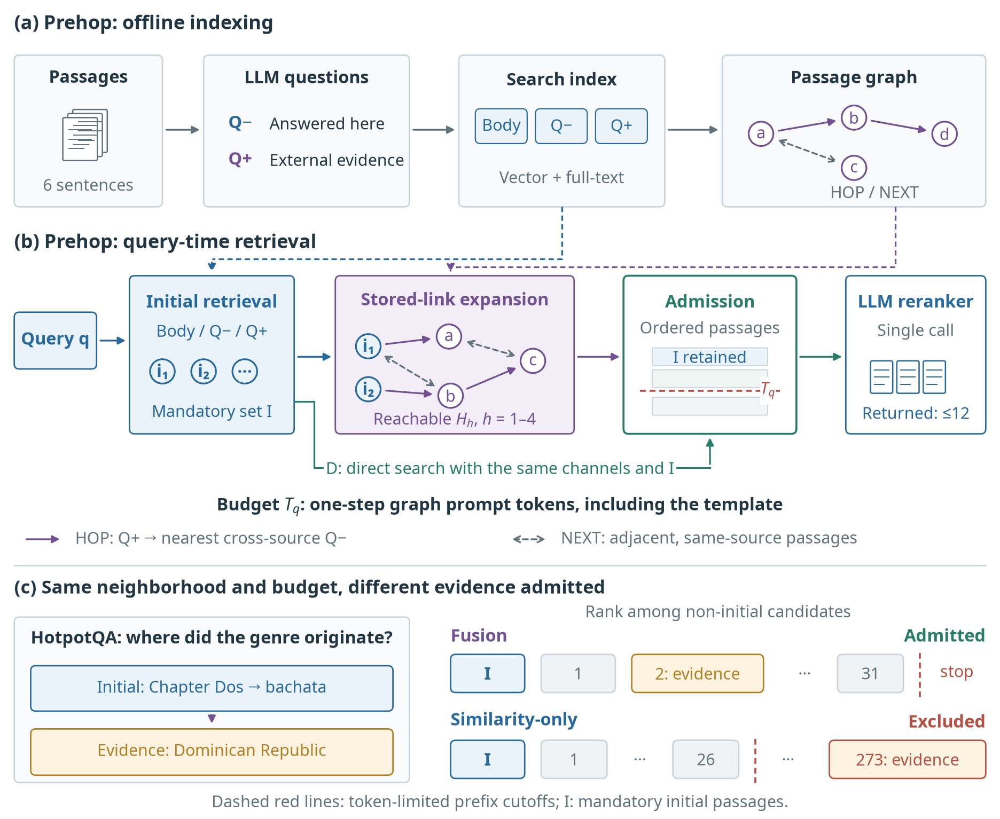
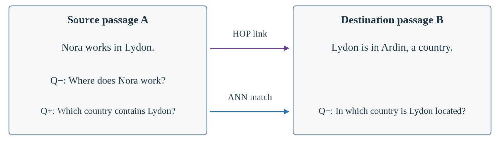
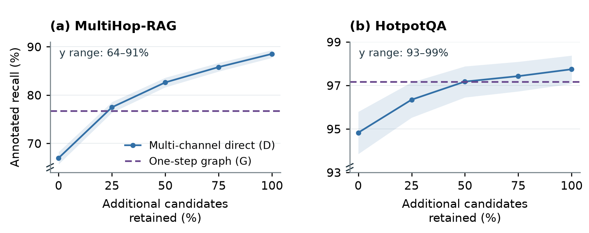
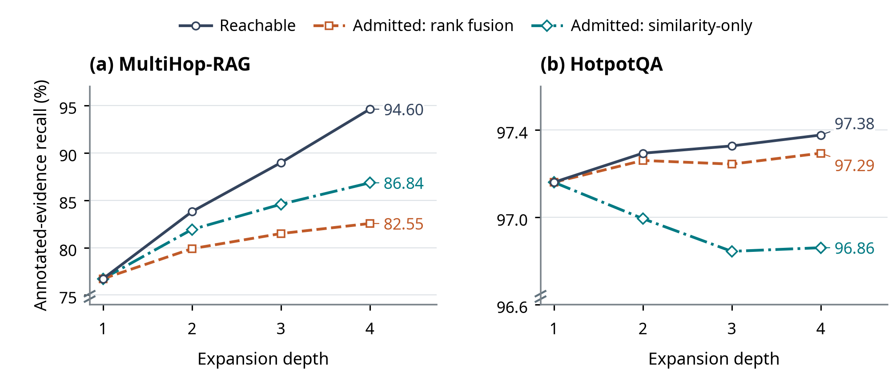

# Prehop: Multi-Hop Retrieval-Augmented Generation

[](LICENSE)

This repository provides the implementation and experiment code for
**Reached but Not Retained: Candidate Admission under Reranker Token Budgets in Graph-Based Multi-Hop RAG**.

The paper studies where graph-retrieved evidence is lost between three stages:
**reachable → admitted → returned**. Prehop, a static question-link passage graph
with one LLM reranking call, is the controlled test bed. On MultiHop-RAG,
four-step expansion reaches **94.60%** annotated recall, but rank-fusion admission
retains **82.55%** under the original one-step reranker input budget. An
annotation-aware construction verifies that all reachable annotations can fit
within that budget on every evidence-bearing question.

The evaluation reports retrieval recall, complete coverage and benchmark-specific
MAP. The implementation also supports answer generation; answer-quality
experiments are outside the paper's scope.

This checkout runs Prehop and the dense baseline (`naive`). Archived results for
other systems can be evaluated from their saved outputs; their implementations
and installation scripts are not included.

| Guide | Purpose |
| --- | --- |
| This README | Understand the project, install it and run a first benchmark |
| [Method](docs/METHOD.md) | Retrieval behavior, comparison controls and code ownership |
| [Setup](docs/SETUP.md) | Service requirements, environment selection and configuration precedence |
| [Reproducing](docs/REPRODUCING.md) | Dataset preparation, experiment commands, evaluation and measurement definitions |

## How Prehop works



Each passage receives two question sets from an LLM. **Q−** questions are
answerable from the passage itself; **Q+** questions ask for information that
lies beyond it. Index-time matching of a passage's Q+ to another source's Q−
creates a directed **HOP** link, and adjacent passages of one source are joined
by **NEXT** links. The question-role formulation follows
[HopRAG](https://arxiv.org/html/2502.12442v2#S3.S2).



At query time the original question searches the body, Q− and Q+ indexes; the
fused hits form the initial passages (**I** in the diagram). Prehop follows outgoing HOP links and
both NEXT directions once from every initial passage, keeps the initial
candidates in the pool, orders the pool by a fused score and passes it to one
LLM reranking request that returns up to 12 passages. The paper traces evidence
through these returned passages. Its depth experiment expands the saved graph
up to four steps and admits whole-passage prefixes under the same per-query
one-step token budget; the standard runtime still expands once.
Stored links propose evidence; the query decides its relevance only through
scoring and reranking. The [method guide](docs/METHOD.md) gives the exact
fusion, scoring and reranking rules.

## Installation

Run the commands below from the repository root on Linux with Bash, Git, curl
and `uv` installed. `uv` can provision Python 3.12. Prepare Neo4j 5.26.21 and an
OpenAI-compatible LiteLLM gateway serving generation and embedding models.
Those services may run on another machine.

```bash
uv sync --locked --python 3.12 --extra dev
test -f .env || cp .env.example .env
```

Fill in the connection and model fields in [.env.example](.env.example), copied
to `.env` above. The [connection settings](docs/SETUP.md#connection-settings)
explain the required services and fields.

Select the environment and request concurrency, then check the connections:

```bash
export PYTHON_BIN="$PWD/.venv/bin/python"
export UV_PROJECT_ENVIRONMENT="$PWD/.venv"
export RAG_EXECUTION_PROFILE="$PWD/configs/execution_profiles/direct-8.json"
./run_servers.sh all
```

`run_servers.sh` checks the configured Neo4j connection and both gateway model
names. It can start a default local Neo4j installation if needed; remote hosts
and custom ports must already be running. It does not start model processes.
Shell launchers and the smoke runner load `.env`, preserving exported overrides.
Keep the exports above in the shell used for the remaining commands.
The [configuration contract](docs/SETUP.md#configuration-ownership-and-precedence)
defines defaults, exported overrides and execution-profile precedence.

## Quick start

With the services ready, run a small real experiment using the included
two-document fixture. No benchmark download is needed:

```bash
export DEMO_RUN="demo-$(date +%Y%m%d-%H%M%S)-$$"
"$PYTHON_BIN" scripts/paper_cold_canary.py "$DEMO_RUN" prehop multihoprag --attempt a1
"$PYTHON_BIN" - <<'PY'
import json, os
from pathlib import Path
path = Path("data/results") / os.environ["DEMO_RUN"] / "cold_v2/a1/multihoprag/prehop/query.json"
result = json.loads(path.read_text())
print("Question:", result["query"])
print("Answer:", result["answer"])
print("Retrieved passages:", len(result["documents"]))
print("Saved result:", path)
PY
```

A successful execution prints `cold_canary_passed` and the generated
answer. The fixture's expected city is **Larkhaven**; the recorded answer lets
you inspect generation quality. The command checks execution, not exact answer
equality. Each invocation above creates a fresh namespace and preserves existing
graphs. See [smoke outputs](docs/REPRODUCING.md#completion-and-continuation) for metadata.

## Run the benchmarks and inspect scores

Prepare both datasets once in a fresh checkout. Do not rerun preparation while
an experiment uses those files:

```bash
"$PYTHON_BIN" scripts/datasets/prepare_multihoprag.py
"$PYTHON_BIN" scripts/datasets/prepare_hotpotqa_hipporag.py --download
```

Run Prehop on both complete question populations and export their scores:

```bash
export BENCH_RUN="prehop-$(date +%Y%m%d-%H%M%S)-$$"
bash scripts/run_paper_target.sh multihoprag prehop "$BENCH_RUN-multihoprag"
bash scripts/run_paper_target.sh hotpotqa prehop "$BENCH_RUN-hotpotqa"

"$PYTHON_BIN" scripts/export_official_results.py \
  "data/results/$BENCH_RUN-multihoprag/prehop/multihoprag/seed_42/prehop_multihoprag.json" \
  "data/results/$BENCH_RUN-hotpotqa/prehop/hotpotqa/seed_42/prehop_hotpotqa.json" \
  --output-dir "data/results/$BENCH_RUN-tables"
cat "data/results/$BENCH_RUN-tables/multihoprag/comparison.csv"
cat "data/results/$BENCH_RUN-tables/hotpotqa/comparison.csv"
```

These runs build the full corpus indexes and make model calls for 2,556 and
1,000 questions. They take substantially longer than the smoke test. To resume,
repeat the target command with its original run ID; keep the prepared corpus,
settings and index unchanged. Choose a new ID for a new experiment.

Each result JSON contains answers, ordered `retrieved_sources` and per-question
scores. Its neighboring `.official.json` contains metric summaries; exports
also produce CSV tables. `failed_rows` records terminal query failures, whose
quality scores remain zero. Completion alone does not imply every query succeeded.

To compare with the dense baseline, follow the
[baseline comparison](docs/REPRODUCING.md#run-a-baseline-comparison). Benchmark
answers use each system's own prompt. Optional
[saved-evidence answer generation](docs/REPRODUCING.md#compare-answer-generation-over-saved-evidence)
is a runtime capability outside the paper's retrieval evaluation.

## Experimental results

Prehop supports controlled comparisons of candidate acquisition and LLM
reranking. The values below describe the reported configurations; new runs can
produce different outputs even at temperature zero. Differences in percentage-valued
metrics use percentage points (pp). Retrieval recall and complete coverage use
2,255 evidence-bearing MultiHop-RAG questions and 1,000 HotpotQA occurrences;
HotpotQA intervals cluster the 944 original questions.

| Comparison | MultiHop-RAG result | Evaluation scope |
| --- | --- | --- |
| One-step expansion versus fixed initial passages | +0.0195 MAP@10; complete coverage@10 rises from 36.45% to 42.53% | Same initial passages and LLM reranking; input sizes differ |
| Multi-channel direct retrieval versus the one-step graph | 80.98% returned recall versus 76.72% graph reachable recall (+4.26 pp) | Same initial passages, index and per-query reranker input ceiling |
| Four-step reachable versus rank-fusion admitted recall | 94.60% versus 82.55% annotated recall | Reachable evidence versus evidence admitted under the original input ceiling |
| Four-step similarity-only admission versus rank fusion | +4.29 pp admitted recall; +3.02 pp returned recall | Same neighborhood, initial passages and input ceiling; membership and presentation order change together |
| Annotation-aware capacity-feasibility diagnostic | All four-step reachable annotations fit on every evidence-bearing question | Same neighborhood, mandatory initial passages and original token ceiling; no reranking |

The central four-step result (paper Table 3) traces the same reachable
neighborhood through both admission policies and their own-order reranking:

| Dataset | Reachable recall | Fusion admitted | Fusion returned | Similarity-only admitted | Similarity-only returned |
| --- | --- | --- | --- | --- | --- |
| MultiHop-RAG | 94.60% | 82.55% | 76.58% | 86.84% | 79.60% |
| HotpotQA | 97.38% | 97.29% | 97.24% | 96.86% | 96.86% |

The annotation-aware construction is a capacity-feasibility certificate: it attains
full-neighborhood annotation coverage, an upper bound for any subset, within the
original ceiling. Thus capacity alone cannot explain the observed admission loss
on these questions. It does not provide an annotation-free policy or predict
reranker performance. Reduced-corpus HotpotQA tests a near-saturated boundary
case: similarity-only admission lowers admitted recall by 0.43 pp, illustrating
the limits of the intervention rather than replicating the MultiHop-RAG gain.

The direct control matches reranker input budgets, not compute or latency. It
searches up to 256 passages per channel; graph retrieval traverses stored links.



Shading shows pointwise 95% bootstrap intervals. The horizontal axis measures
additional passages beyond the initial set; the dashed line is one-step graph coverage.



Recall axes in the depth figure are truncated and use different ranges; slopes
and vertical distances are not comparable across panels.

Appendix H reports the fixed-initial-passage ablation, evidence partition and
direct-prefix coverage. Intermediate prefixes measure coverage only; only the
full direct pool is matched to the one-step input ceiling.

The fixed-initial, three-policy and four-step comparisons use separate
recorded reranking runs. They answer different questions and are not one combined
leaderboard. Direct retrieval's returned context can contain more annotated evidence
than the entire one-step graph pool, locating part of the recall deficit before
LLM reranking. Body-only direct retrieval returns 81.57% recall under the same input ceiling;
it uses its own initial passages and is a complete-policy comparison.

See the [experiment inventory](docs/REPRODUCING.md#paper-experiment-inventory)
for inputs, paired intervals, reranking repetitions and limitations.
Figure exports are included in `docs/figures/`; exact reconstruction of archived
results requires the saved inputs listed in the reproduction guide.

## Repository layout

| Path | Contents |
| --- | --- |
| `main.py`, `cli/` | Indexing, benchmark and shared answer-generation entry points |
| `models/prehop/` | Passage chunking, question generation, link construction, hybrid retrieval, one-step expansion, scoring and LLM reranking |
| `models/naive/` | The dense title/body baseline on the same index infrastructure |
| `core/` | Configuration, inference transport, structured outputs, evaluation, checkpoints and run identity |
| `scripts/` | Dataset preparation, experiment runners, controlled analyses, statistics and exports |
| `utils/` | Metrics, HotpotQA support projection, prompts and provenance |
| `configs/` | Execution profiles, the smoke fixture and prompt-development question IDs |
| `docs/` | The three guides and the figure exports used on this page |
| `tests/` | Unit tests with mocked services; integration tests are marked |

## Development

Run the unit tests from the repository root using the prepared environment:

```bash
.venv/bin/python -m pytest -q -m "not integration"
```

Unit tests use fixtures and mocked Neo4j/inference boundaries. Some tests need
optional saved experiment artifacts and are skipped when those are absent.
Integration tests require configured services and are explicitly marked.
Tests check implementation behavior; they do not reproduce paper scores.

Use the [module map](docs/METHOD.md#code-ownership) to locate implementation
changes and [experiment controls](docs/REPRODUCING.md#select-a-reference) when
changing methods, prompts or metrics.

## Data and reproducibility

The source checkout contains code, tests, configuration examples, dependency
specifications and static figures. Downloaded corpora, indexes, checkpoints,
traces and generated results are stored locally under `data/` and excluded from
Git. Reuse explicit result paths when exporting scores; the exporter records
source hashes and preserves the inputs.

New benchmark runs are supported directly by this checkout. Exact replay of
archived experiments additionally requires the graphs, candidate pools and
recorded outputs listed in [Reproducing experiments](docs/REPRODUCING.md).

## License and attribution

Repository-owned code is released under the [MIT License](LICENSE).
Datasets retain their respective licenses. HotpotQA source attribution and
its reduced-corpus evaluation setting are documented in the
[dataset guide](docs/REPRODUCING.md#hotpotqa-source-and-population).
