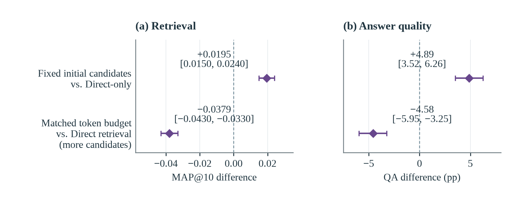
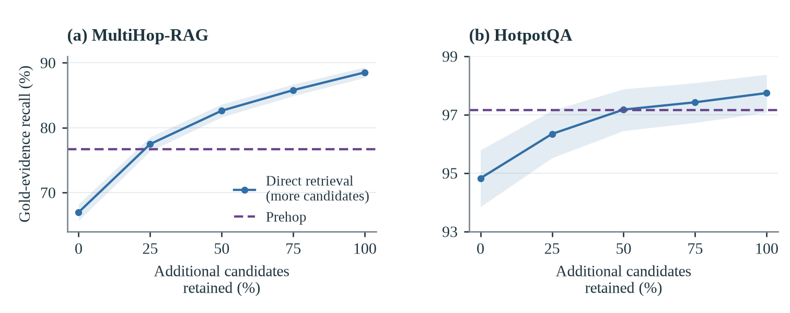
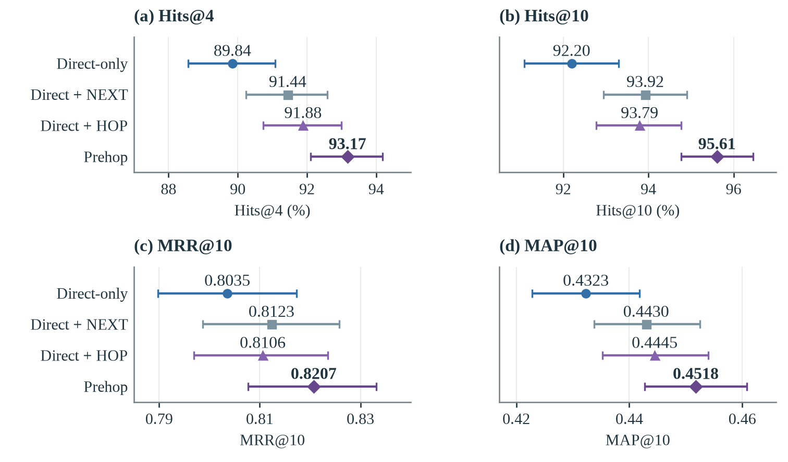
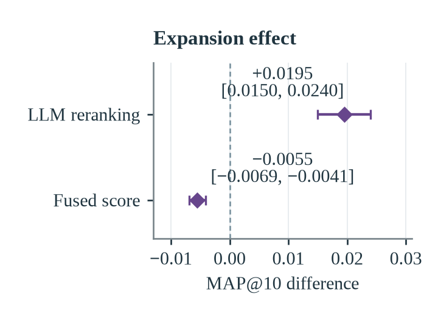

# Prehop: Graph Expansion, Direct Retrieval and Candidate Admission for Multi-Hop RAG

[](LICENSE)

Prehop is a graph-based retriever for multi-hop retrieval-augmented generation
(RAG). During indexing it generates questions for every passage and stores
links between passages; at query time it retrieves initial candidates, expands
the stored links once, reranks the combined pool with an LLM and generates an
answer from the returned passages. This repository is the implementation and
experiment code behind two manuscripts that use Prehop as a controlled test
bed:

- **Does One-Step Graph Expansion Beat Retrieving More Candidates? A
  Matched-Budget Comparison for Multi-Hop RAG** compares one-step expansion
  with direct retrieval that receives the same reranker input token budget.
- **Reachability versus Inherited Scores: Candidate Admission under a Reranker
  Input Ceiling in Graph-Based Multi-Hop RAG** asks which reachable evidence
  survives when deeper neighborhoods must fit the same input ceiling.

[Method and implementation](docs/METHOD.md) ·
[Reproducing the experiments](docs/REPRODUCING.md) ·
[Runtime setup](docs/SETUP.md)

## How Prehop works


Each passage receives two question sets from an LLM. **Q−** questions are
answerable from the passage itself; **Q+** questions ask for information that
lies beyond it. Index-time matching of a passage's Q+ to another source's Q−
creates a directed **HOP** link, and adjacent passages of one source are joined
by **NEXT** links. The question-role formulation follows
[HopRAG](https://arxiv.org/html/2502.12442v2#S3.S2).


At query time the original question searches the body, Q− and Q+ indexes; the
fused hits form the initial candidates. Prehop follows outgoing HOP links and
both NEXT directions once from every initial candidate, keeps the initial
candidates in the pool, orders the pool by a fused score and passes it to one
LLM reranking request that returns up to 12 passages for answer generation.
Stored links propose evidence; the query decides its relevance only through
scoring and reranking. The [method guide](docs/METHOD.md) gives the exact
fusion, scoring and reranking rules.

## What the experiments show

The figures below are static exports of the manuscripts' figures. They plot
reported means and paired bootstrap intervals from saved outputs; regenerating
them requires the archived results described in the
[experiment inventory](docs/REPRODUCING.md#paper-experiment-inventory).

### Expansion helps against fixed initial candidates, direct retrieval wins under a matched budget



With the initial candidates fixed, one-step HOP/NEXT expansion plus LLM
reranking raises MultiHop-RAG MAP@10 by 0.0195 and official QA accuracy by 4.89
percentage points. When direct retrieval may instead add candidates until it
fills the same per-query reranker input token budget, it beats Prehop by 0.0379
MAP@10 and 4.58 points, and the gap grows with the budget: at a quarter and a
half of the allowance beyond the initial candidates it is 1.7 and 3.5 QA points,
more budget raises direct retrieval's QA but not expansion's, and pruning the
expansion pool by query similarity does not close it. The HotpotQA comparison,
on a reduced corpus whose initial candidates already cover 94.8% of the
annotated support, is inconclusive. Reproduce with the
[HOP/NEXT ablation](docs/REPRODUCING.md#compare-hop-and-next-expansion) and the
[matched-budget comparison](docs/REPRODUCING.md#compare-graph-expansion-against-direct-retrieval-with-more-candidates).

### Direct retrieval recovers most of the evidence that expansion adds



The two methods add largely different passages, yet direct retrieval with more
candidates recovers 89.6% (MultiHop-RAG) and 69.8% (HotpotQA) of the gold
evidence that expansion adds, and on MultiHop-RAG its final 12-passage answer
context covers more annotated evidence than Prehop's entire candidate pool. A
body-only direct search under the same budget keeps that advantage. Reproduce
with the
[evidence accessibility analysis](docs/REPRODUCING.md#evidence-accessibility-in-saved-candidate-pools).

### Both link types contribute, and the gain depends on the ranking method





HOP and NEXT links each improve retrieval when the other is present. Under a
score-based ordering of the same candidate pools, however, expansion slightly
lowers MAP@10; the gain appears only with LLM reranking. Reproduce with the
[ranking-method comparison](docs/REPRODUCING.md#compare-ranking-methods-with-fixed-candidates).

### Deeper neighborhoods reach more evidence than the input ceiling admits


Expanding the saved graph through four steps reaches 94.6% of MultiHop-RAG's
annotated evidence, but only 82.6% fits the one-step input ceiling under
Prehop's rank-fusion order; ordering candidates by query-to-body cosine admits
86.8%, still below the 89.3% that body-only direct retrieval reaches under the
same ceiling. Carried through LLM reranking, cosine admission raises the
recall of the returned passages by 3.0 points, while its QA gain of 1.2 points
does not resolve, and presenting the rank-fusion set in Prehop's own fused order
rather than cosine order is worth a similar 1.3 QA points. On HotpotQA deeper
expansion adds almost no evidence. These
analyses replay saved graphs and candidate sets; the
[V2 fixed-input analyses](docs/REPRODUCING.md#v2-fixed-input-analyses) list
their inputs and limits.

## Installation

Run the commands below from the repository root on Linux with Bash, Git, curl
and `uv` installed. `uv` can provision Python 3.12. Prepare Neo4j 5.26.21 and an
OpenAI-compatible LiteLLM gateway serving generation and embedding models.
Those services may run on another machine.

```bash
uv sync --locked --python 3.12 --extra dev
test -f .env || cp .env.example .env
```

Edit `.env` to match your infrastructure:

| Setting | Value to supply |
| --- | --- |
| `NEO4J_URI` | Bolt URI, including your host and port |
| `NEO4J_USER`, `NEO4J_PASSWORD` | Database credentials |
| `NEO4J_DATABASE` | Optional database name; defaults to `neo4j` |
| `RAG_INFERENCE_BASE_URL` | Gateway API base URL, including `/v1` when applicable |
| `RAG_INFERENCE_API_KEY` | Gateway credential |
| `RAG_GENERATION_MODEL` | Registered generation model; paper alias is in `.env.example` |
| `RAG_EMBEDDING_MODEL` | Registered embedding model; paper alias is in `.env.example` |
| `NEO4J_VECTOR_DIMENSIONS` | Actual embedding dimensions; paper value is in `.env.example` |

The gateway must support chat completions with JSON-schema output and embeddings.
The embedding model must return the configured number of dimensions. Changing
models or method settings defines a different experiment.

Select the environment and request concurrency, then check the connections:

```bash
export PYTHON_BIN="$PWD/.venv/bin/python"
export UV_PROJECT_ENVIRONMENT="$PWD/.venv"
export RAG_EXECUTION_PROFILE="$PWD/configs/execution_profiles/direct-8.json"
./run_servers.sh all
```

`run_servers.sh` checks the configured Neo4j connection and both gateway model
names. It can start a default local Neo4j installation if needed; remote hosts
and custom ports must already be running. It does not start model processes.
Shell launchers and the smoke runner load `.env`, preserving exported overrides.
Keep the exports above in the shell used for the remaining commands.
Settings resolve in this order: registry defaults, `.env`, exported values,
then the selected execution profile for its throughput fields. Choose throughput
in the profile; it overrides matching concurrency variables. Python and shell
entrypoints use the same resolver. See the
[configuration contract](docs/SETUP.md#configuration-ownership-and-precedence)
for ownership and precedence.

## Reviewer checks

After installing the test tools above, these checks work even before configuring
Neo4j, model credentials, or downloaded benchmark corpora:

```bash
.venv/bin/python -m pytest -q -m "not integration"
```

These tests cover implementation behavior using fixtures and mocked service
boundaries; they do not reproduce paper scores. Optional checks for saved
experiment artifacts may be skipped.

## Quick start

With the services ready, run a small real experiment using the included
two-document fixture. No benchmark download is needed:

```bash
export REVIEW_RUN="reviewer-$(date +%Y%m%d-%H%M%S)-$$"
"$PYTHON_BIN" scripts/paper_cold_canary.py "$REVIEW_RUN" prehop multihoprag --attempt a1
"$PYTHON_BIN" - <<'PY'
import json, os
from pathlib import Path
path = Path("data/results") / os.environ["REVIEW_RUN"] / "cold_v2/a1/multihoprag/prehop/query.json"
result = json.loads(path.read_text())
print("Question:", result["query"])
print("Answer:", result["answer"])
print("Retrieved passages:", len(result["documents"]))
print("Saved result:", path)
PY
```

A successful execution prints `cold_canary_passed` and the generated
answer. The fixture's expected city is **Larkhaven**; the recorded answer lets
you inspect generation quality. The command checks execution, not exact answer
equality. Each invocation above creates a fresh namespace and preserves existing
graphs. See [smoke outputs](docs/REPRODUCING.md#completion-and-continuation) for metadata.

## Run the benchmarks and inspect scores

Prepare both datasets once in a fresh checkout. Do not rerun preparation while
an experiment uses those files:

```bash
"$PYTHON_BIN" scripts/datasets/prepare_multihoprag.py
"$PYTHON_BIN" scripts/datasets/prepare_hotpotqa_hipporag.py --download
```

Run Prehop on both complete question populations and export their scores:

```bash
export BENCH_RUN="prehop-$(date +%Y%m%d-%H%M%S)-$$"
bash scripts/run_paper_target.sh multihoprag prehop "$BENCH_RUN-multihoprag"
bash scripts/run_paper_target.sh hotpotqa prehop "$BENCH_RUN-hotpotqa"

"$PYTHON_BIN" scripts/export_official_results.py \
  "data/results/$BENCH_RUN-multihoprag/prehop/multihoprag/seed_42/prehop_multihoprag.json" \
  "data/results/$BENCH_RUN-hotpotqa/prehop/hotpotqa/seed_42/prehop_hotpotqa.json" \
  --output-dir "data/results/$BENCH_RUN-tables"
cat "data/results/$BENCH_RUN-tables/multihoprag/comparison.csv"
cat "data/results/$BENCH_RUN-tables/hotpotqa/comparison.csv"
```

These runs build the full corpus indexes and make model calls for 2,556 and
1,000 questions. They take substantially longer than the smoke test. To resume,
repeat the target command with its original run ID; keep the prepared corpus,
settings and index unchanged. Choose a new ID for a new experiment.

Each result JSON contains answers, ordered `retrieved_sources` and per-question
scores. Its neighboring `.official.json` contains metric summaries; exports
also produce CSV tables. `failed_rows` records terminal query failures, whose
quality scores remain zero. Completion alone does not imply every query succeeded.

The dense baseline (`naive`) uses the same environment, fixed passage windows,
embedding model, Neo4j vector index and gateway. Run and export both
dataset/system pairs for the comparison:

```bash
export COMPARISON_RUN="comparison-$(date +%Y%m%d-%H%M%S)-$$"
results=()
for dataset in multihoprag hotpotqa; do
  for method in prehop naive; do
    run_id="$COMPARISON_RUN-$dataset-$method"
    bash scripts/run_paper_target.sh "$dataset" "$method" "$run_id" || break 2
    results+=("data/results/$run_id/$method/$dataset/seed_42/${method}_${dataset}.json")
  done
done
if [ "${#results[@]}" -eq 4 ]; then
  "$PYTHON_BIN" scripts/export_official_results.py "${results[@]}" \
    --output-dir "data/results/$COMPARISON_RUN-tables"
fi
```

These commands evaluate each system's benchmark answer pipeline. The paper's
comparison with a shared answer generator needs the separate
[saved-evidence answer replay](docs/REPRODUCING.md#compare-answer-generation-over-saved-evidence). The
[experiment guide](docs/REPRODUCING.md) covers that distinction, the HOP/NEXT
expansion controls and timing measurements. New runs produce their own results;
identical settings do not guarantee identical generated answers or times.

## Controlled experiments and the figures they produce

| Figure above | Comparison | Entry point |
| --- | --- | --- |
| Paired differences (fixed initial candidates) | HOP/NEXT ablation and fixed-candidate QA | `scripts/run_primary_hop_ablation.py`, `scripts/analyze_expansion_factorial.py`, `scripts/compare_prehop_direct_qa.py` |
| Paired differences (matched budget) and evidence coverage | Direct retrieval with more candidates under Prehop's per-query token budget; evidence overlap and retention | archived matched-budget protocol, `scripts/analyze_evidence_accessibility.py`, `scripts/analyze_ablation_links.py` |
| HOP/NEXT expansion and ranking methods | Four expansion conditions; LLM reranking against score-based orders on the same pools | `scripts/run_primary_hop_ablation.py`, `scripts/compare_prehop_selectors.py` |
| Depth and admission | One- to four-step neighborhoods under the original ceiling | saved-graph replay packages listed in the [V2 fixed-input analyses](docs/REPRODUCING.md#v2-fixed-input-analyses) |
| Not shown: shuffled-link control | Question links against degree-preserving rewired links at matched candidate counts | `scripts/analyze_link_supply.py` |

Paired intervals use `scripts/ablation_statistics.py` (10,000 resamples, seed
42, HotpotQA clustered by original question). Official scores come from
`scripts/export_official_results.py`.

## Repository layout

| Path | Contents |
| --- | --- |
| `main.py`, `cli/` | Indexing, benchmark and shared answer-generation entry points |
| `models/prehop/` | Passage chunking, question generation, link construction, hybrid retrieval, one-step expansion, scoring and LLM reranking |
| `models/naive/` | The dense title/body baseline on the same index infrastructure |
| `core/` | Configuration, inference transport, structured outputs, evaluation, checkpoints and run identity |
| `scripts/` | Dataset preparation, experiment runners, controlled analyses, statistics and exports |
| `utils/` | Metrics, HotpotQA support projection, prompts and provenance |
| `configs/` | Execution profiles, the smoke fixture and prompt-development question IDs |
| `docs/` | The three guides and the figure exports used on this page |
| `tests/` | Unit tests with mocked services; integration tests are marked |

## Saved results and documentation

The public documentation consists of this README and the three guides below.
The repository includes implementation code, tests, configuration examples,
dependency specifications and static figure exports. Working manuscripts,
figure sources, review notes, credentials, downloaded corpora and generated
runs remain local and are excluded from source tracking.

The commands above create new measurements. Replaying archived paper results
requires the original outputs, indexes or traces identified in the
[experiment guide](docs/REPRODUCING.md#paper-experiment-inventory); these are not
bundled with the source checkout. If you already have saved benchmark results,
pass their explicit paths to `scripts/export_official_results.py` to inspect
scores without model calls. The exporter records source hashes and keeps the
original results unchanged.

- [Method and implementation](docs/METHOD.md): retrieval behavior, code ownership and traces.
- [Runtime setup](docs/SETUP.md): services and configuration ownership.
- [Reproducing and evaluation](docs/REPRODUCING.md): populations, metrics, resume, controlled experiments and measurement scope.

## License and attribution

Repository-owned code is released under the [MIT License](LICENSE).
Datasets retain their respective licenses. HotpotQA source attribution is
documented in [the dataset guide](docs/REPRODUCING.md#hotpotqa-source-and-population).
