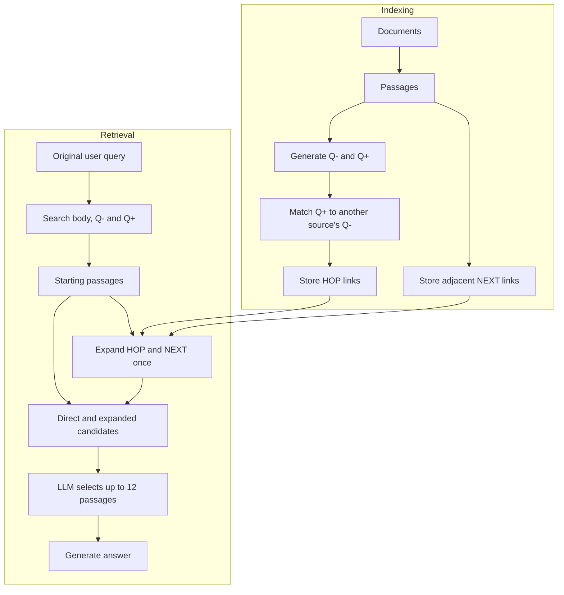

# Prehop: Precomputed Question Links for Multi-Hop Retrieval

[](LICENSE)

Prehop investigates how far multi-hop evidence retrieval can be supported by
connections built before a user query arrives. During indexing, it generates
questions for each passage and matches them to passages in other sources.
At query time, it retrieves starting passages, expands their stored connections
once, and selects evidence with an LLM before generating an answer.

[Reproduce the experiments](docs/REPRODUCING.md) ·
[Method and implementation](docs/METHOD.md) ·
[Runtime setup](docs/SETUP.md)

## How it works

Each passage has two question representations:

- **Q−:** questions whose answers are in this passage.
- **Q+:** questions that seek information beyond this passage.

Index-time matching connects a passage's Q+ to a Q− belonging to a passage in
another source. These directed **HOP** links complement **NEXT** links between
adjacent passages in the same source. The question-role formulation follows
[HopRAG](https://arxiv.org/html/2502.12442v2#S3.S2).



The query searches all three representations and combines their passage ranks.
Every retrieved starting passage can activate its stored links. Direct passages
remain candidates; graph-discovered passages are not expanded again. Stored
links are candidate connections, not complete answer paths: query-dependent
retrieval, scoring and selection still determine the final evidence.

## Installation

Run the commands below from the repository root on Linux with Bash, Git, curl
and `uv` installed. `uv` can provision Python 3.12. Prepare Neo4j 5.26.21 and an
OpenAI-compatible LiteLLM gateway serving generation and embedding models.
Those services may run on another machine.

```bash
uv sync --locked --python 3.12 --extra dev
test -f .env || cp .env.example .env
```

Edit `.env` to match your infrastructure:

| Setting | Value to supply |
| --- | --- |
| `NEO4J_URI` | Bolt URI, including your host and port |
| `NEO4J_USER`, `NEO4J_PASSWORD` | Database credentials |
| `NEO4J_DATABASE` | Optional database name; defaults to `neo4j` |
| `RAG_INFERENCE_BASE_URL` | Gateway API base URL, including `/v1` when applicable |
| `RAG_INFERENCE_API_KEY` | Gateway credential |
| `RAG_GENERATION_MODEL` | Registered generation model; paper alias is in `.env.example` |
| `RAG_EMBEDDING_MODEL` | Registered embedding model; paper alias is in `.env.example` |
| `NEO4J_VECTOR_DIMENSIONS` | Actual embedding dimensions; paper value is in `.env.example` |

The gateway must support chat completions with JSON-schema output and embeddings.
The embedding model must return the configured number of dimensions. Changing
models or method settings defines a different experiment.

Select the environment and request concurrency, then check the connections:

```bash
export PYTHON_BIN="$PWD/.venv/bin/python"
export UV_PROJECT_ENVIRONMENT="$PWD/.venv"
export RAG_EXECUTION_PROFILE="$PWD/configs/execution_profiles/direct-8.json"
./run_servers.sh all
```

`run_servers.sh` checks the configured Neo4j connection and both gateway model
names. It can start a default local Neo4j installation if needed; remote hosts
and custom ports must already be running. It does not start model processes.
Shell launchers and the smoke runner load `.env`, preserving exported overrides.
Keep the exports above in the shell used for the remaining commands.
Settings resolve in this order: registry defaults, `.env`, exported values,
then the selected execution profile for its throughput fields. Choose throughput
in the profile; it overrides matching concurrency variables. Python and shell
entrypoints use the same resolver. See the
[configuration contract](docs/SETUP.md#configuration-ownership-and-precedence)
for ownership and method-specific overrides.

## Reviewer checks

After installing the test tools above, these checks work even before configuring
Neo4j, model credentials, or downloaded benchmark corpora:

```bash
.venv/bin/python -m pytest -q -m "not integration"
```

These tests cover implementation behavior using fixtures and mocked service
boundaries; they do not reproduce paper scores. Optional checks for locally
installed native runtimes or saved experiment artifacts may be skipped.

## Quick start

With the services ready, run a small real experiment using the included
two-document fixture. No benchmark download or baseline installation is needed:

```bash
export REVIEW_RUN="reviewer-$(date +%Y%m%d-%H%M%S)-$$"
"$PYTHON_BIN" scripts/paper_cold_canary.py "$REVIEW_RUN" prehop multihoprag --attempt a1
"$PYTHON_BIN" - <<'PY'
import json, os
from pathlib import Path
path = Path("data/results") / os.environ["REVIEW_RUN"] / "cold_v2/a1/multihoprag/prehop/query.json"
result = json.loads(path.read_text())
print("Question:", result["query"])
print("Answer:", result["answer"])
print("Retrieved passages:", len(result["documents"]))
print("Saved result:", path)
PY
```

A successful execution prints `cold_native_canary_passed` and the generated
answer. The fixture's expected city is **Larkhaven**; the recorded answer lets
you inspect generation quality. The command checks execution, not exact answer
equality. Each invocation above creates a fresh namespace and preserves existing
graphs. See [smoke outputs](docs/REPRODUCING.md#completion-and-continuation) for metadata.

## Run the benchmarks and inspect scores

Prepare both datasets once in a fresh checkout. Do not rerun preparation while
an experiment uses those files:

```bash
"$PYTHON_BIN" scripts/datasets/prepare_multihoprag.py
"$PYTHON_BIN" scripts/datasets/prepare_hotpotqa_hipporag.py --download
```

Run Prehop on both complete question populations and export their scores:

```bash
export BENCH_RUN="prehop-$(date +%Y%m%d-%H%M%S)-$$"
bash scripts/run_paper_target.sh multihoprag prehop "$BENCH_RUN-multihoprag"
bash scripts/run_paper_target.sh hotpotqa prehop "$BENCH_RUN-hotpotqa"

"$PYTHON_BIN" scripts/export_official_results.py \
  "data/results/$BENCH_RUN-multihoprag/prehop/multihoprag/seed_42/prehop_multihoprag.json" \
  "data/results/$BENCH_RUN-hotpotqa/prehop/hotpotqa/seed_42/prehop_hotpotqa.json" \
  --output-dir "data/results/$BENCH_RUN-tables"
cat "data/results/$BENCH_RUN-tables/multihoprag/comparison.csv"
cat "data/results/$BENCH_RUN-tables/hotpotqa/comparison.csv"
```

These runs build the full corpus indexes and make model calls for 2,556 and
1,000 questions. They take substantially longer than the smoke test. To resume,
repeat the target command with its original run ID; keep the prepared corpus,
settings and index unchanged. Choose a new ID for a new experiment.

Each result JSON contains answers, ordered `retrieved_sources` and per-question
scores. Its neighboring `.official.json` contains metric summaries; exports
also produce CSV tables. `failed_rows` records terminal query failures, whose
quality scores remain zero. Completion alone does not imply every query succeeded.

For the seven-system comparison, first prepare the additional runtimes:

```bash
./scripts/setup_official_baselines.sh
```

This installs pinned HopRAG, LightRAG, GFM-RAG and LinearRAG environments and
their local models. MS GraphRAG uses the main environment. The pinned native
runtimes target Linux x86-64; check the
[CUDA/compiler and model prerequisites](docs/SETUP.md#source-and-setup-isolation)
before installation. Then run and export all fourteen dataset/system pairs:

```bash
export COMPARISON_RUN="comparison-$(date +%Y%m%d-%H%M%S)-$$"
results=()
for dataset in multihoprag hotpotqa; do
  for method in prehop naive hoprag ms_graphrag lightrag gfm_rag linear_rag; do
    run_id="$COMPARISON_RUN-$dataset-$method"
    bash scripts/run_paper_target.sh "$dataset" "$method" "$run_id" || break 2
    results+=("data/results/$run_id/$method/$dataset/seed_42/${method}_${dataset}.json")
  done
done
if [ "${#results[@]}" -eq 14 ]; then
  "$PYTHON_BIN" scripts/export_official_results.py "${results[@]}" \
    --output-dir "data/results/$COMPARISON_RUN-tables"
fi
```

These commands evaluate each system's native answer pipeline. The paper's
common-reader comparison needs the separate
[saved-evidence answer replay](docs/REPRODUCING.md#compare-a-common-reader-over-saved-evidence). The
[experiment guide](docs/REPRODUCING.md) covers that distinction, ablations and
timing measurements. New runs produce their own results; identical settings do
not guarantee identical generated answers or times.

## Saved results and documentation

This source release does not bundle the authors' generated results, indexes or
traces. The commands above create new measurements; they do not display an
included paper-result archive. If you already have saved benchmark results,
pass their explicit paths to `scripts/export_official_results.py` to inspect
scores without model calls. The exporter records source hashes and keeps the
original results unchanged.

- [Method and implementation](docs/METHOD.md): retrieval and adapter behavior, code ownership and traces.
- [Runtime setup](docs/SETUP.md): services, isolated native environments and configuration ownership.
- [Reproducing and evaluation](docs/REPRODUCING.md): populations, metrics, resume, controlled experiments and measurement scope.

## License and attribution

Repository-owned code is released under the [MIT License](LICENSE).
External implementations and datasets retain their respective licenses.
Method sources and pinned revisions are listed in
[the strategy registry](core/strategy_registry.py); HotpotQA source attribution
is documented in [the dataset guide](docs/REPRODUCING.md#hotpotqa-source-and-population).
