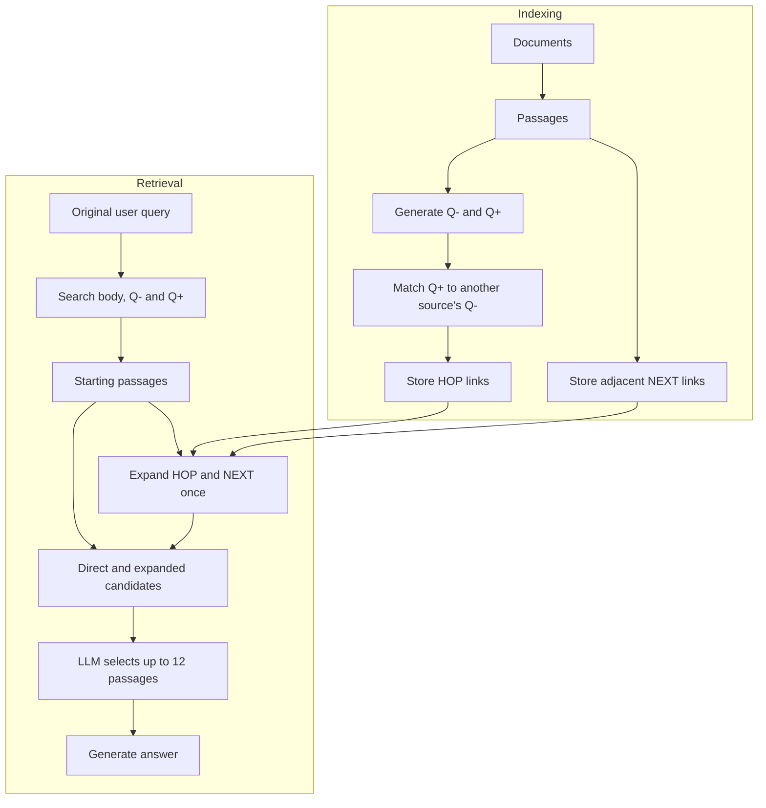

# Prehop: Precomputed Question Links for Multi-Hop Retrieval

[](LICENSE)

Prehop investigates how far multi-hop evidence retrieval can be supported by
connections built before a user query arrives. During indexing, it generates
questions for each passage and matches them to passages in other sources.
At query time, it retrieves starting passages, expands their stored connections
once, and selects evidence with an LLM before generating an answer.

[Reproduce the experiments](docs/REPRODUCING.md) ·
[Method and implementation](docs/ARCHITECTURE.md) ·
[Runtime setup](docs/RUNTIME_REQUIREMENTS.md)

## How it works

Each passage has two question representations:

- **Q−:** questions whose answers are in this passage.
- **Q+:** questions that seek information beyond this passage.

Index-time matching connects a passage's Q+ to a Q− belonging to a passage in
another source. These directed **HOP** links complement **NEXT** links between
adjacent passages in the same source. The question-role formulation follows
[HopRAG](https://arxiv.org/html/2502.12442v2#S3.S2).



The query searches all three representations and combines their passage ranks.
Every retrieved starting passage can activate its stored links. Direct passages
remain candidates; graph-discovered passages are not expanded again. Stored
links are candidate connections, not complete answer paths: query-dependent
retrieval, scoring and selection still determine the final evidence.

## Installation

Run the commands below from the repository root on Linux with Bash, Git and
`uv` installed. `uv` can provision Python 3.12. Prehop also requires Neo4j
5.26.21 and an OpenAI-compatible LiteLLM gateway serving generation and
embedding models. Docker is one way to run Neo4j:

```bash
uv sync --locked --python 3.12
cp .env.example .env

docker run -d --name prehop-neo4j -p 7474:7474 -p 7687:7687 \
  -e 'NEO4J_AUTH=neo4j/<your_password>' neo4j:5.26.21-community
```

Set the same password in `NEO4J_PASSWORD`, and configure
`RAG_INFERENCE_BASE_URL`, `RAG_INFERENCE_API_KEY`, `RAG_GENERATION_MODEL` and
`RAG_EMBEDDING_MODEL` in `.env`. Use the gateway's API base URL, including its
`/v1` path when applicable. The experiment configuration uses
`gemma-4-31b-it` and `qwen3-embedding-4b` with 2,560-dimensional embeddings.
Model services are supplied separately; `run_servers.sh` does not start them.
For the full comparison, prepare the additional runtimes once:

```bash
./scripts/setup_official_baselines.sh
```

This installs HopRAG, LightRAG, GFM-RAG and LinearRAG from pinned sources and
downloads their required local models. MS GraphRAG uses the main environment.
The pinned native runtimes target Linux x86-64. See
[runtime setup](docs/RUNTIME_REQUIREMENTS.md#source-and-setup-isolation) for
installation paths, GFM-RAG's CUDA/compiler prerequisites, and the command to
install only HopRAG.

## Quick start

From the repository root, prepare MultiHop-RAG and run Prehop on its full query
set. These commands construct an index and call the configured model services:

```bash
.venv/bin/python scripts/datasets/prepare_multihoprag.py
./run_servers.sh all
./run_multihoprag.sh all --model prehop --queries full
```

Keep the prepared corpus unchanged while a run uses it. Shell launchers load
`.env` while preserving exported overrides. The quick start uses those settings;
the [named comparison launcher](docs/REPRODUCING.md#run-a-system-comparison)
selects the benchmark generation and execution settings explicitly.

Preparation writes `data/multihoprag_corpus/` and
`data/multihoprag_queries.json`. The benchmark writes saved answers, retrieved
passages and per-question scores under `data/results/`; index metadata is under
`data/index_stats/`. Use [the experiment guide](docs/REPRODUCING.md) for named
runs, comparison settings, ablations and scoring saved passage lists.

## Evaluation

Experiments compare Prehop, HopRAG, MS GraphRAG, LightRAG, GFM-RAG, LinearRAG
and Naive RAG on MultiHop-RAG and the HippoRAG HotpotQA release. MultiHop-RAG
uses 609 documents and 2,556 questions; retrieval scores use its 2,255 questions
with gold evidence. HotpotQA uses a pooled corpus of 9,221 passages and 1,000
released occurrences, representing 944 original questions. This is a reduced
retrieval corpus, not the official HotpotQA fullwiki setting.

The common retrieval measures are Hits@4, Hits@10, MRR@10 and the MultiHop-RAG
MAP@10 definition, plus supplementary distinct-gold Recall@10. The four ranking
measures are official for MultiHop-RAG and adapted to supporting-sentence
identities for HotpotQA. Native answer and supporting-fact scores remain
separate outcomes. See [evaluation and outputs](docs/REPRODUCING.md#evaluate-saved-results)
for definitions and commands.

## Documentation

- [Reproducing experiments](docs/REPRODUCING.md): settings, runs, ablations and evaluation.
- [Architecture](docs/ARCHITECTURE.md): indexing, retrieval and code organization.
- [HotpotQA data and metrics](docs/HOTPOTQA.md): source, preparation and sentence identities.
- [Runtime requirements](docs/RUNTIME_REQUIREMENTS.md): models and external environments.
- [Execution and measurement](docs/THROUGHPUT_EXECUTION.md): scheduling, recovery and timing scope.

The root `third_party/HopRAG` checkout is historical reference material; the
runtime guide describes the supported HopRAG execution. Run-generated data,
indexes and traces are local outputs. They are not bundled with this source
release. Code checks are described in [the contributor instructions](AGENTS.md#verification).

## License and attribution

Repository-owned code is released under the [MIT License](LICENSE).
External implementations and datasets retain their respective licenses.
Method sources and pinned revisions are listed in
[the strategy registry](core/strategy_registry.py); HotpotQA source attribution
is documented in [the dataset guide](docs/HOTPOTQA.md#source-and-population).
